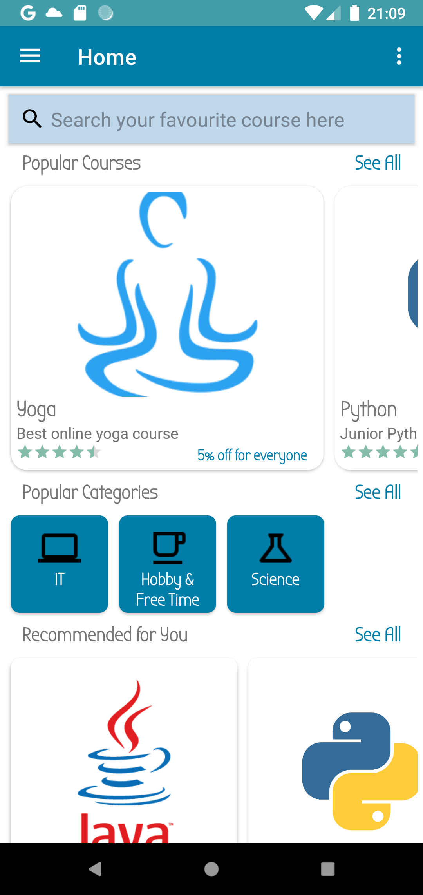
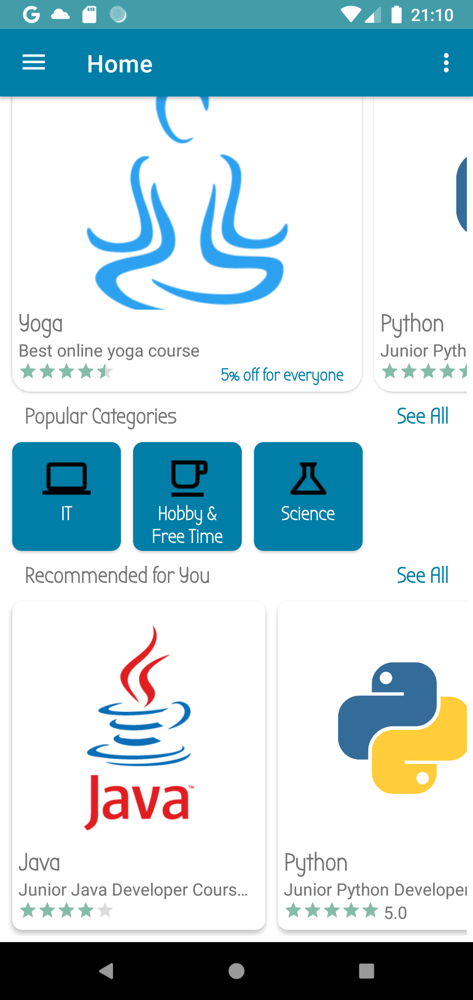
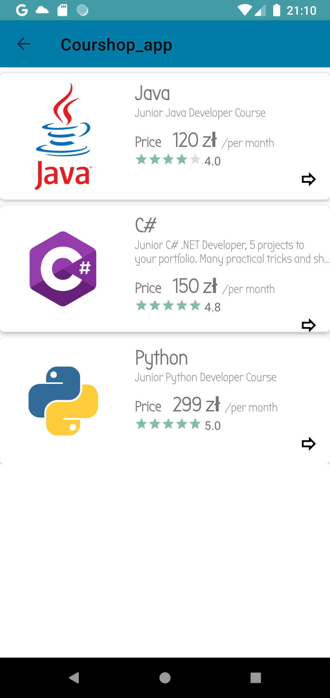
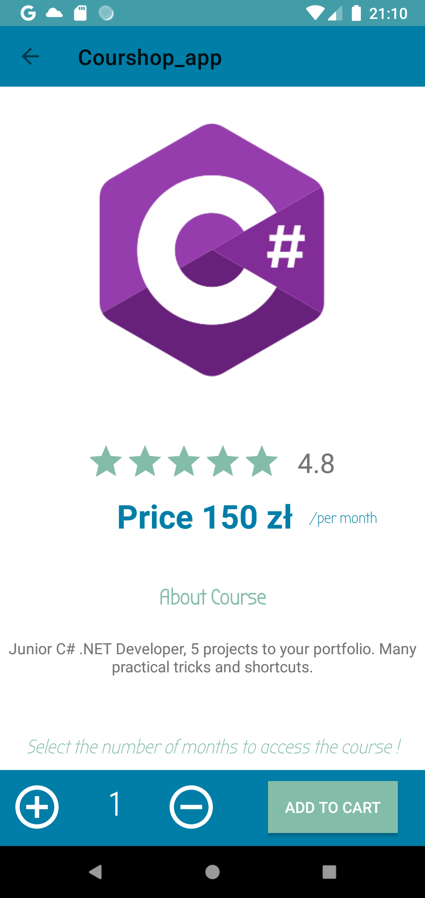
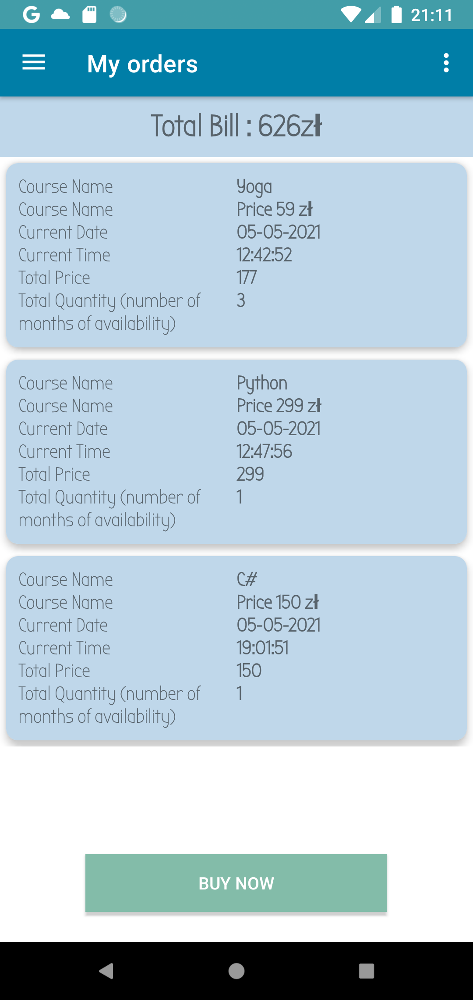
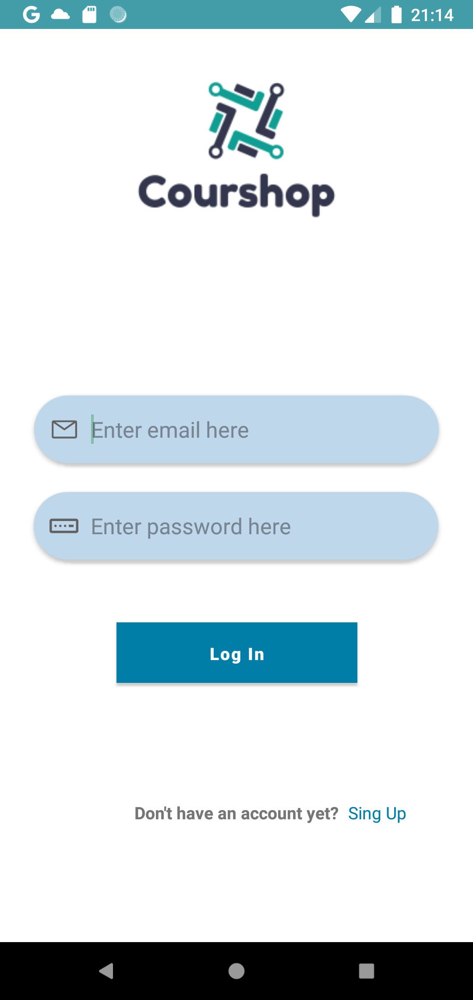
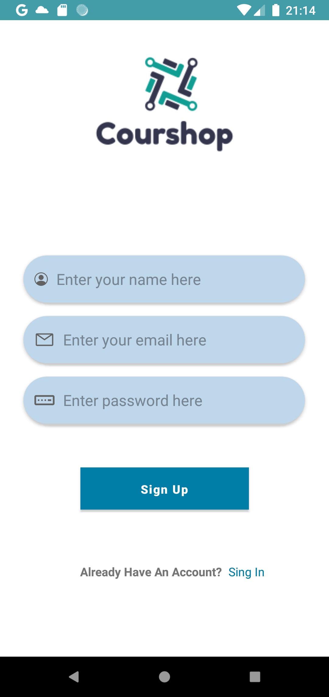

# Courshop_app
An android application for viewing online courses, buying and learning from purchased courses.
 

## Technology
<ul>
  <li>Java</li>
  <li>Android Studio v.4.1.3</li>
  <li>Firebase</li>
  <li>Git v.2.3.1</li>
</ul>

## Screenshots
### Home View

 

 

### Category View

 

 

### Detailed Course View

 

### My orders view

 

### Login & Register View

 

 

### Firebase 

 

 

 
