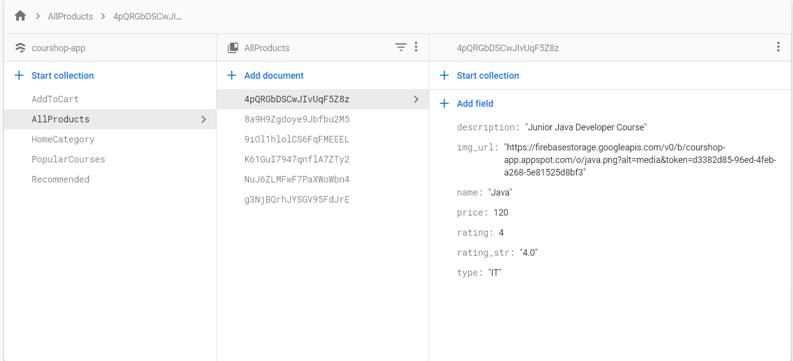
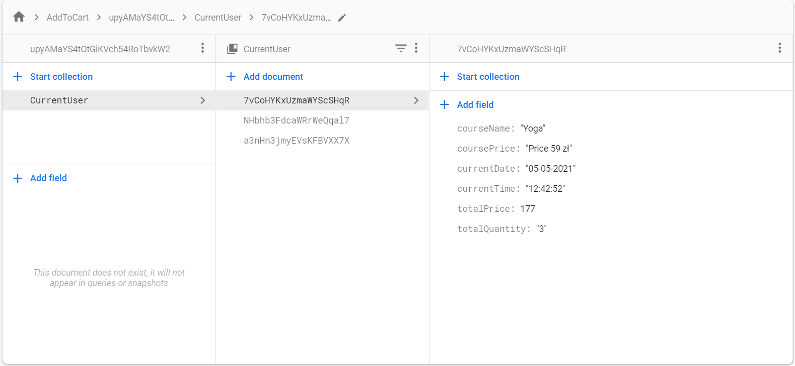
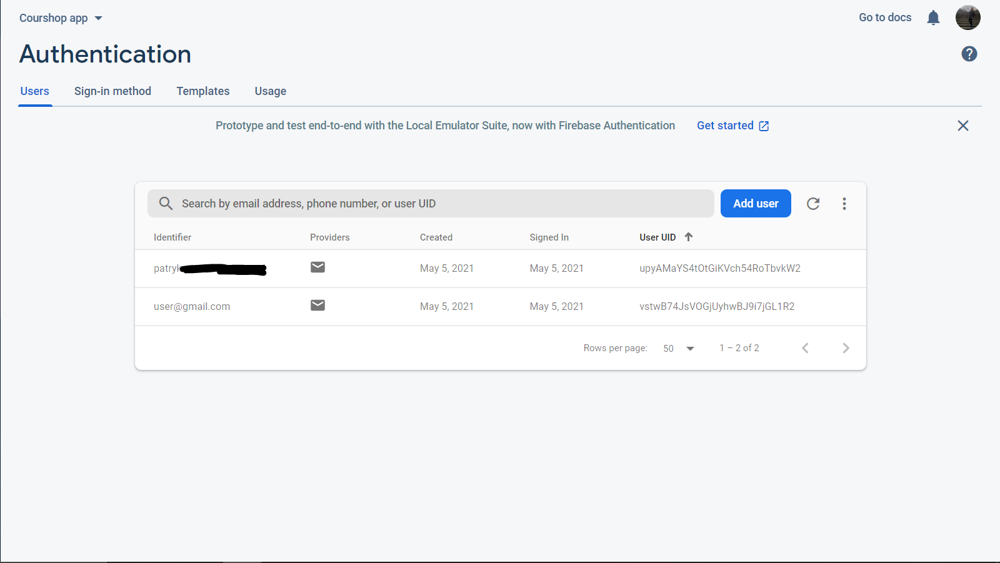

# Courshop_app

## Description 
An android application for viewing online courses, buying and learning from purchased courses. 
 

## How it works
<ol>
<li> Course data is stored in Firebase and includes course name, description, rating, price and category. 
<li> Viewing courses is available only after creating a user account or logging into one's own account. 
<li> After selecting the appropriate course you can go to the detailed view of the course, where you can add the number of months for which you buy access to the course.
<li> In the 'My Orders' tab you will see the data downloaded from Firebase with our orders and the total price for all purchases.
</ol>

## Authors
<ul>
  <li>Patryk Pawłowicz</li>
  <li>Paweł Szczodrowski</li>
</ul>

## Technology
<ul>
  <li>Java</li>
  <li>Android Studio v.4.1.3</li>
  <li>Firebase</li>
  <li>Git v.2.3.1</li>
</ul>

## Screenshots
### Home View

 

### Category View

 

### Detail Course View

 

### Orders view

 

### Login & Register View

 

### Firebase 

 

 

 

## Under development

<ul>
  <li>New Courses View  -  with the newest courses</li>
  <li>Profile View - with profile image and ability to change our profile data (name, password)</li>
</ul>
